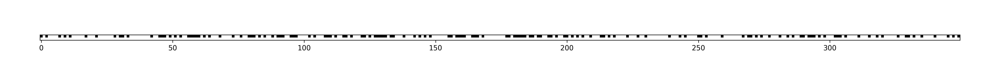
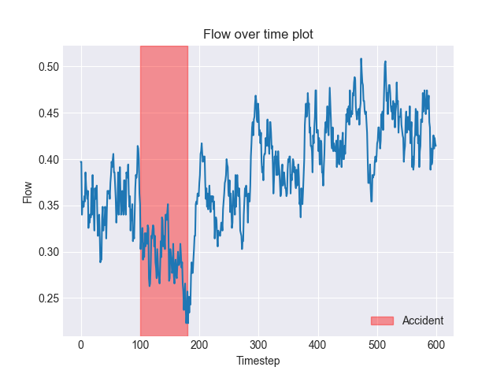
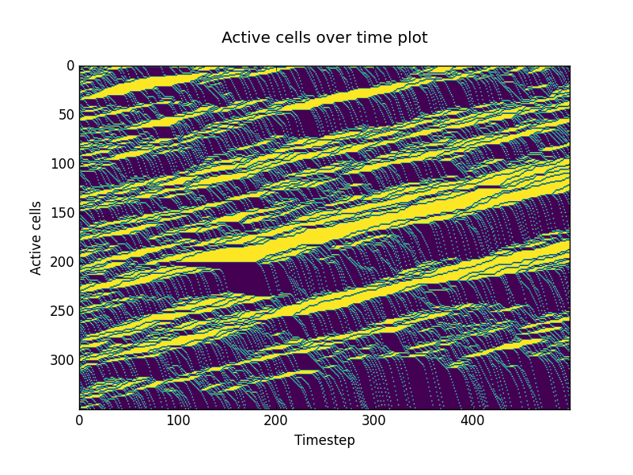

# traffic-ca
Modelling traffic using cellular automata. Currently only supports NaSch (STCA) model with car entry queue and soft boundary.


## Background
Python package written as part of the final project 'Modeling traffic using Cellular Automata' for the course 'Mathematical Modeling and Simulation' at Prirodno-matematički fakultet, Univerzitet u Tuzli. The final project paper (written in Bosnian language) is available [here](paper.pdf).\
Built on top of [cellpylib](https://github.com/lantunes/cellpylib) -  *Antunes, L. M. (2021). CellPyLib: A Python Library for working with Cellular Automata. Journal of Open Source Software, 6(67), 3608.*

## How to install
1. Create and activate conda environment.
```shell
conda create -n traffic_ca python=3.10
conda activate traffic_ca
```
2. Install the package.
```shell
pip install -e .
```
## Example usage
Run `python traffic_ca/main.py` for an example STCA animation. 
```python
from traffic_ca.automaton import TrafficCA
from traffic_ca.entity.accident import Accident

tca = TrafficCA(
    accident=Accident(position=100, start_timestep=100, duration=80),
    timesteps=600,
)
# Animate
tca.animate()
# Various plots
tca.plot_flow_time()
tca.plot_space_time()
tca.plot_density_time()
tca.plot_mean_velocity_time()
```
### Sample plots
<p align="center">
  
   
</p>

## Citation
The repo can be cited as:
> Nadir Bašić (2023). TrafficCA: Modelling Traffic using Cellular Automata. Prirodno-matematički fakultet, Univerzitet u Tuzli

